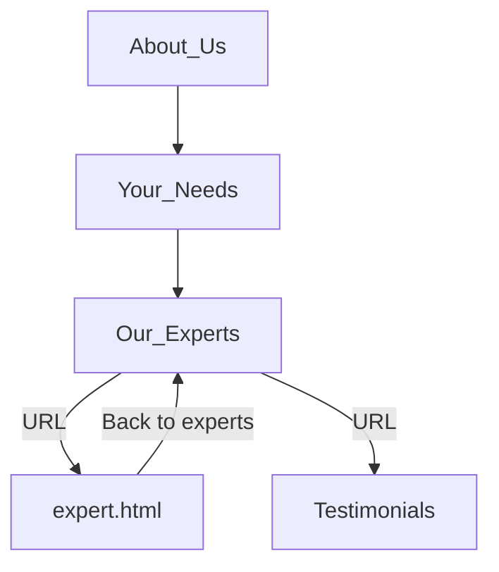

## 1. Structure a site using semantic HTML to aid accessibility
  Accessibility was one of the main requirements. We found out that it is not always possible to keep a perfect accessibility and also the design/technology decisions, so there is always a balance to mantain.
  Perfectly accessible sites may not have all the functionality or the looks that wew stated on the design phase.

### index.html:

* `<header>` : I used this for the header section of my website.
* `<nav>`: I wrapped the navigation menu with this element.
* `<ul>` and `<li>`: These were used to create an unordered list for navigation links.
* `<main>`: I encapsulated the main content of my webpage with this.
* `<section>`: I used this multiple times to structure different content sections.
* `<h1>`, `<h2>`, and `<h3>`: I used these headings to define content hierarchy.
* `<p>`: I used this for paragraphs of text.
* ``: I used this to embed images with alt attributes for accessibility.
* `<form>`: I used this to create a contact form.
* `<label>`: I associated it with form fields for labeling.
* `<button>`: I used it for buttons within forms.
* `<footer>`: I used this for the footer section of my webpage.
  
### expert.html:

* `<main>`: I encapsulated the main content of my expert page with this element.
* `<div>` and `<article>`: I used these for structuring content about experts.
* `<label>`: I associated it with form fields for labeling.
* `<input>`, `<textarea>`, and `<button>`: These were the form elements I used for user interaction.
* `<h2>`: I used this for subheadings to organize content.
* `<button>`: I used it for navigation back to the expert list.
* `<div>`: I created a modal window for captcha with this element.
  
I must clarify that our site consists in two pages, being index.html the main one and expert.html is dynamically created passing the ID of the expert as parameter on the URL.



## 2. Ensure a web page is readable for screen readers

Utilizing proper semantic HTML elements, as mentioned earlier, is essential to ensure that our webpage is accessible to screen readers.

All the images on our site contain alt attributes with descriptions of the images. The only exception is the captcha modal window. While the captcha is fully functional and visually appealing, in a real-world scenario, we would use reCaptcha or a similar solution.

Additionally, we have incorporated ARIA attributes to enhance accessibility.

## 3. Ensure our UI has sufficient colour contrast so that everyone can perceive it comfortably

We have chosen a color palette that consists of dark fonts on light backgrounds and light fonts on dark backgrounds.
These colors are defined as root variables, making it easy to modify the color palette by simply changing these values.

On the expert page, we have also used a dark color to indicate that the 'send' button in the contact form is disabled until all fields are filled out. This design choice may make the button text slightly more difficult to read. However, in this case, we prioritize aesthetics and color conventions, such as using dark colors to indicate disabled elements.


<div align="center">

</div>


## 4. Use various tools to check that our website meets accessibility criteria

We just used Lighthouse, the built-in web page and web app analyzer in Chrome Developer Tools.

## 5. Use CSS media queries to ensure our content is always presented effectively on screens of different sizes

We employed media queries in three steps to adapt the content for various devices, including desktops, tablets, and phones. In the attached screenshot, you can observe variations in element sizes, as well as the reorganization of grid elements.

```CSS
@media (max-width: 1024px) {
    .grid-container-services {
        grid-template-columns: 49% calc(2% - 1.25rem) 49%;
        max-width: 90%;
        row-gap: 3rem;
    }
    footer {
        padding: 0 3.125rem 0 3.125rem;
    }
    .team-member-card {
        max-width: 250px;
    }
}


@media (max-width: 767px) {
    .grid-container-services {
        grid-template-columns: 1fr;
        /* 1 column for phones */
        grid-template-rows: repeat(8, auto);
        /* Adjust the number of rows */
        row-gap: 0;
        width: 95%;
    }
    .grid-item-service {
        padding: 0 1.25rem;
    }
    .img-cell1,
    .img-cell2,
    .img-cell3,
    .img-cell4 {
        grid-column: auto;
        /* Reset column placement for smaller screens */
        grid-row: auto;
        /* Reset row placement for smaller screens */
    }
    .order3 {
        order: 3;
    }
    .order4 {
        order: 4;
    }
```

## 6. Demonstrate a mobile-first approach to building a website

We didn't follow a mobile-first approach on our website. Instead, we tailored the size of every element to be screen-size dependent, including gaps, fonts, margins, and more. We also utilized wrapping in flexboxes to automatically adapt the distribution of elements. This approach allowed us to write code that is as universal as possible. While it worked well for most cases, there were still instances where we needed to use media queries for specific parts of our site. Scaling everything isn't always sufficient.

## 7. Use CSS variables to apply repeated colours to HTML elements

We employed CSS variables to define all the colors, fonts, and shadows. Perhaps our process was not the most streamlined one: we initially created the entire page and then established a variable for each element. If a similar color was already present in the palette, we utilized it; otherwise, we added new variables.

```CSS
/*Global variables*/
:root {
    --white: #fff;
    --lightest-color: #f4f4f4;
    --lightest-transparent:rgba(233, 233, 233, 0.767);
    --dark-white: #ddd;
    --light-grey: rgba(146,146,146,0.45);
    --medium-grey: rgba(209,209,209,0.45);
    --medium-dark-grey: rgba(37,37,37,0.51);
    --dark-grey: rgba(0,0,0,0.58);
    --darker-grey: rgba(0,0,0,0.85);
    --burgundy: rgba(87,10,10,0.75);

    --font-titles: WindSong, cursive;
    --font-main: Prompt, sans-serif;

    --box-shadow-light: 0 0 1.25rem rgba(0,0,0,0.58);
    --box-shadow-dark: 0 0 1.25rem rgba(0,0,0,0.8);
    --box-shadow-small: 0 0 0.75rem rgba(0,0,0,0.4);
} 
```

## 8. Use CSS Flexbox to style children in a single-direction layout (ie a row or a column)

We don't have any examples of single-direction flexboxes in our code; instead, we use nested flexboxes. In the example below, there is a parent horizontal flexbox (represented by the burgundy rectangle), and inside it, there is a child vertical flexbox (depicted by the green rectangle) within a modal window. This approach provides us with better adaptability compared to using a grid and helps minimize our use of media queries.


<div align="center">

</div>


## 9. Use CSS Grid to style children in two-direction layout

We used a grid for our stunning captcha. This element always has the same aspect ratio and won't use wrap properties, so using grid here was the simplest solution.

```CSS
/* Create a 3x3 grid using flexbox */
.captcha-grid {
    display: flex;
    flex-wrap: wrap;
    justify-content: space-between; /* Create 3 columns */
    gap: 1vw; /* Adjust the gap between images as needed */
    width: auto;
    height: 100%;
    max-height: 100vh;
}
.captcha-cell {
    flex: 0 0 calc(33.33% - 1vw); /* Adjust the width for 3 columns and spacing */
    height: auto;
    margin-bottom: 1vw; /* Adjust the margin for spacing between rows */
}
.captchaImage {
    max-width: 100%; 
    max-height: 100%;
}
.captcha-text {
    color: #f4f4f4;
    font-size: calc(1.6vw + 16px);
    margin-bottom: 1vw;  
    width: 100%;
}
```

<div align="center">

</div>


## 10. Ensure our Git commit history tells a coherent story

## 11. Use the appropriate input types in HTML forms for gathering different types of information
